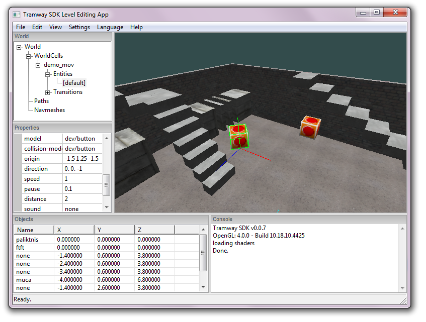

# Tramway SDK Level Editor

## To-do list

- Make signal list let you search for entities by name
- Add to config a list which signals each entity has
- Rewrite parts of code to make it more understandable
	- Current languaging system not good
- Add thing that lets you do stuff in degrees
- ~~Add menu to select grid size~~
- ~~Add snapping to grid~~
- Make navmesh editing easier
- Add thing that adds a default id to entities
- Also default name should be none
- New entities should be spawned in front of view

### Small features
- Cut/Copy/Paste
- Disable undo/redo buttons when these actions can't be performed
- Add a settings menu
	- Change the length of the undo/redo chain
	- Change the key bindings
- A menu that shows undo/redo history
	- Need to add some metadata to undo/redo actions
- Viewport transforms better when multiple axis
- Record the mouse pointer position when capturing it for the viewport and restore it when releasing it
- Shift key for viewport
	- ~~When camera around, it would make the camera speed faster~~
	- When moving objects, it would move them faster
		- Regular object moving speed should be decreased
- Rendering for non-entity objects
	- Transitions
	- Navmeshes
	- Paths
- ~~Make widget selections follow global Editor selections~~
- Switch to using framework Files for configuration
- Add modified flags to objects
	- Add IsModified() method
		- Recursively checks children too
	- Actions save also flag, not only modified property
- Rewrite language again
	- Put all of the string names in a map

### Bugs
- Find some bugs
- Fix some bugs
	
### Other features
- 2D viewport
	- Locks the camera angle facing towards the Z axis
	- Different viewport movement
- Grid rendering in viewport
- ~~Viewport transform snapping~~
	- ~~Snapping to grid for translations~~
	- ~~Snapping to 15/30/45 degrees for rotations~~
	- ~~Will need a special menu to configure the snap ammount~~
- Viewport transforms in different coordinate spaces
	- ~~World space~~
	- Entity group space
	- ~~Entity space~~
- Different rotation measurements
	- Radians
	- Degrees
- ~~Objects selectable through the viewport~~
